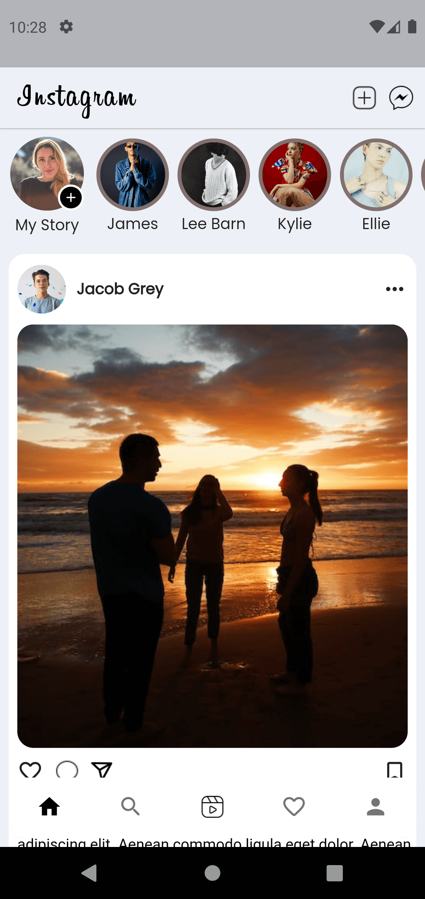
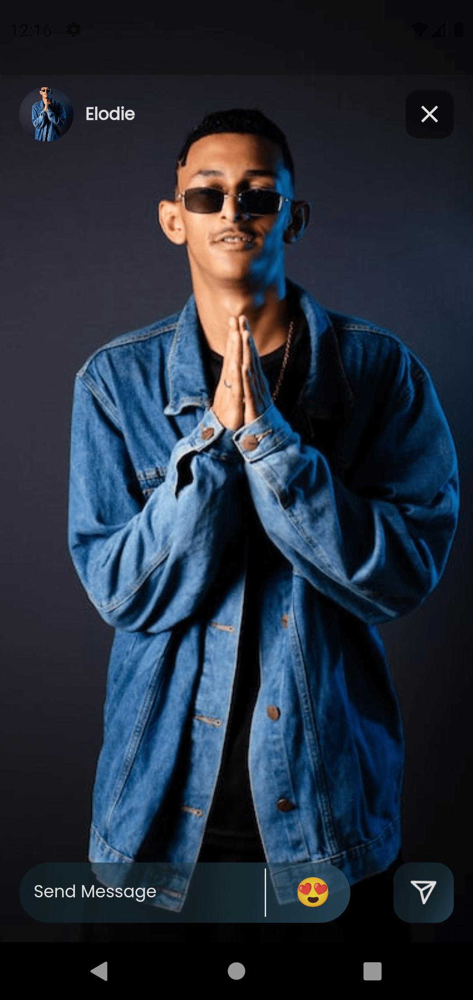
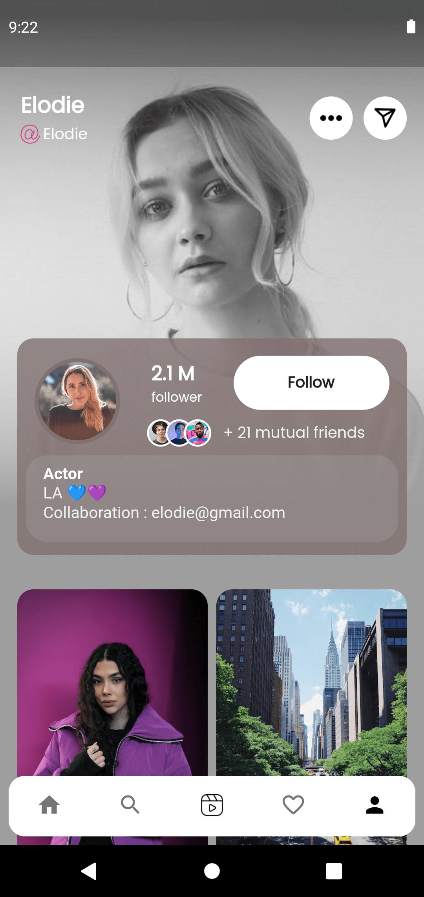

# Instagram Redesign UI

A Mordern Instagram App UI made using Flutter.

## Getting Started

---

1. Clone the Repository `git clone https://github.com/vishwas-kr/Instagram-Redesign.git`.
2. Run `flutter pub get` to install all dependencies.
3. Run `flutter run` in terminal to run the app on an emulator or physical device.

This project is a starting point for a Flutter application.

### App Screenshots

  

A few resources to get you started if this is your first Flutter project:

- [Lab: Write your first Flutter app](https://docs.flutter.dev/get-started/codelab)
- [Cookbook: Useful Flutter samples](https://docs.flutter.dev/cookbook)

For help getting started with Flutter development, view the
[online documentation](https://docs.flutter.dev/), which offers tutorials,
samples, guidance on mobile development, and a full API reference.
